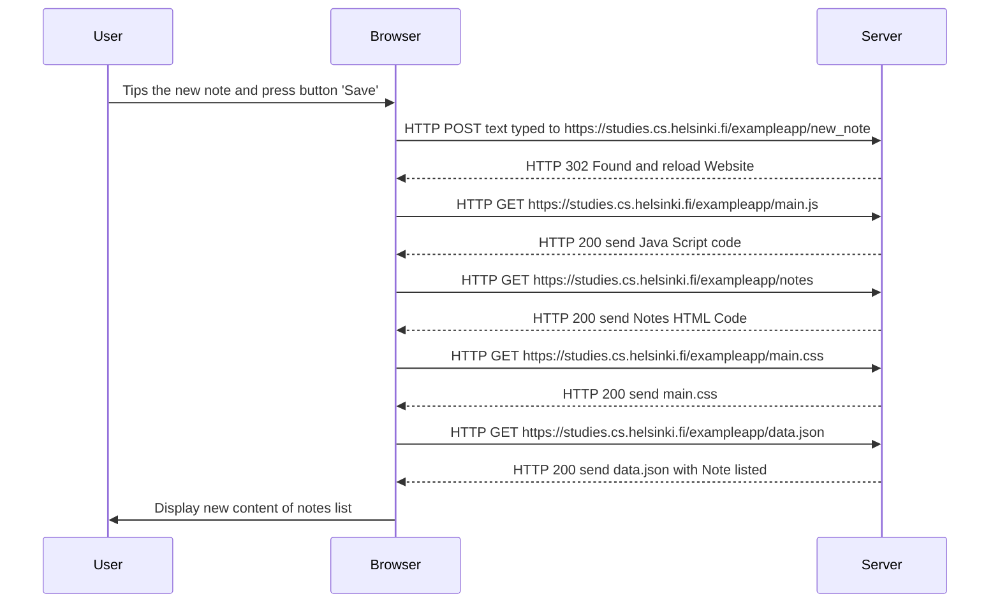

```mermaid
sequenceDiagram
    participant User
    participant Browser
    participant Server
    User->>Browser: Tips the new note and press button 'Save'
    Browser->>Server: HTTP POST text typed to https://studies.cs.helsinki.fi/exampleapp/new_note
    Server-->>Browser: HTTP 302 Found and reload Website
    Browser->>Server: HTTP GET https://studies.cs.helsinki.fi/exampleapp/main.js
    Server-->>Browser: HTTP 200 send Java Script code
    Browser->>Server: HTTP GET https://studies.cs.helsinki.fi/exampleapp/notes
    Server-->>Browser: HTTP 200 send Notes HTML Code
    Browser->>Server: HTTP GET https://studies.cs.helsinki.fi/exampleapp/main.css
    Server-->>Browser: HTTP 200 send main.css
    Browser->>Server: HTTP GET https://studies.cs.helsinki.fi/exampleapp/data.json
    Server-->>Browser: HTTP 200 send data.json with Note listed
    Browser->>User: Display new content of notes list
```
