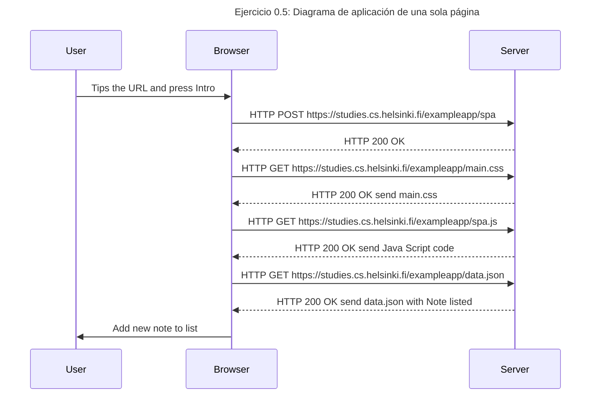

```mermaid
sequenceDiagram
    title Ejercicio 0.5: Diagrama de aplicación de una sola página
    participant User
    participant Browser
    participant Server
    User->>Browser: Tips the URL and press Intro
    Browser->>Server: HTTP POST https://studies.cs.helsinki.fi/exampleapp/spa
    Server-->>Browser: HTTP 200 OK
    Browser->>Server: HTTP GET https://studies.cs.helsinki.fi/exampleapp/main.css
    Server-->>Browser: HTTP 200 OK send main.css
    Browser->>Server: HTTP GET https://studies.cs.helsinki.fi/exampleapp/spa.js
    Server-->>Browser: HTTP 200 OK send Java Script code
    Browser->>Server: HTTP GET https://studies.cs.helsinki.fi/exampleapp/data.json
    Server-->>Browser: HTTP 200 OK send data.json with Note listed
    Browser->>User: Add new note to list
```